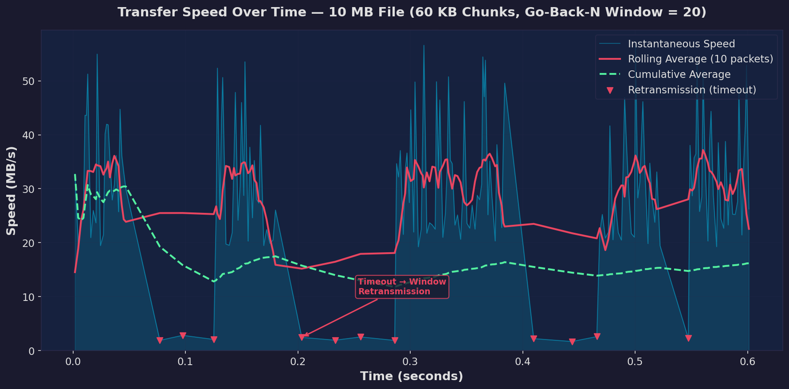
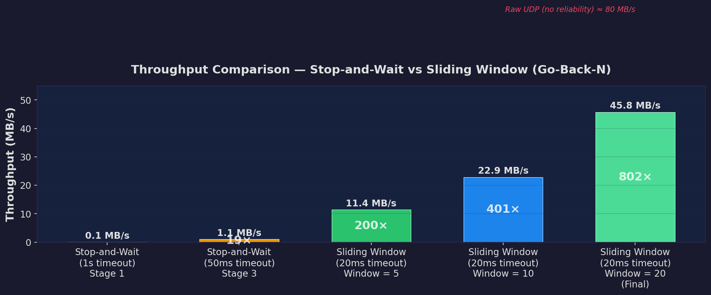
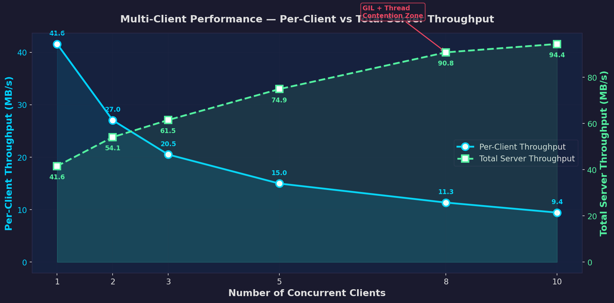

# 📦 SwiftSend – Reliable File Transfer Protocol (UDP)


A custom **reliable file transfer protocol built over UDP** featuring Go-Back-N sliding window transmission, SHA-256 integrity verification, resumable downloads, multi-client concurrency, and both desktop (PyQt6) and web (Flask) interfaces.

---

## 🚀 Features

- 📡 **Reliable file transfer over UDP** — application-layer reliability built from scratch
- 📦 **Chunk-based transmission** — files split into 60 KB chunks for efficient transfer
- 🔄 **Go-Back-N Sliding Window** — 20 packets in-flight simultaneously for high throughput
- 🔐 **SHA-256 integrity verification** — server and client independently hash and compare
- ⏯ **Resumable downloads** — interrupted transfers can continue from the last checkpoint
- 👥 **Multi-client support** — each client gets a dedicated thread and socket (no ACK collisions)
- 🖥 **PyQt6 Server GUI** — start/stop server, view logs, see network IP
- 🌐 **Flask Web Client** — download files from a browser with pause/resume and progress tracking
- ⏸ **Pause / Resume** — withhold ACKs to stall the server without data loss
- 📊 **Real-time speed monitoring** — average speed, instantaneous speed, and completion progress
- ⚡ **Optimized UDP packet size** — 60,000 byte chunks (near the 65,507 byte UDP max)

---

## 🧠 How It Works

UDP does not guarantee packet delivery, ordering, or integrity. This project implements all of these at the **application layer** to demonstrate how protocols like TCP achieve reliability internally.

### Protocol Flow

1. Client sends `GET filename` to the server on port 12000
2. Server spawns a **dedicated thread** with a **new socket** (random port) for the client
3. A **custom UDP handshake** (`ACCEPT` → `ACK_ACCEPT`) redirects the client to the new port
4. Server computes the **SHA-256 hash** of the file and sends the file size
5. File is divided into **60 KB chunks** and sent using **Go-Back-N sliding window** (window = 20)
6. Client **ACKs each packet** — the window slides forward as ACKs arrive
7. On **timeout (20ms)**, the server resends the entire unacknowledged window
8. Client detects **duplicate/out-of-order packets** and discards them
9. After all data is received, client computes **SHA-256** and compares with server's hash

```
Client                              Server (Port 12000)
  |                                       |
  | ------- GET filename seq -----------> |  (Main socket)
  |                                       |  [Spawns thread + new socket]
  |                          Server (New Port)
  | <---------- ACCEPT ------------------ |
  | ------- ACK_ACCEPT ----------------> |
  |                                       |
  | <---------- SIZE filesize ----------- |
  |                                       |
  | <---- SEQ 0 | DATA ------------------ |  ┐
  | <---- SEQ 1 | DATA ------------------ |  │ Sliding Window
  |           ...                         |  │ (up to 20 packets)
  | <---- SEQ 19 | DATA ----------------- |  ┘
  |                                       |
  | ---------- ACK 0 ------------------> |  Window slides →
  | ---------- ACK 1 ------------------> |
  |           ...                         |
  |                                       |
  | <---------- END --------------------- |
  | <---------- HASH sha256hex ---------- |
  |       [Client verifies hash]          |
```

---

## 📂 Project Structure

```
SwiftSend-Reliable-File-Transfer-Protocol-/
│
├── server.py                    # UDP server — Go-Back-N, threading, SHA-256
├── client.py                    # CLI client — ACKs, resume, pause, speed tracking
├── server_gui.py                # PyQt6 desktop GUI for server control
├── app.py                       # Flask web server for browser-based client
├── web_client.py                # Download logic for Flask client (background thread)
├── multi_client_generator.py    # Spawns N concurrent clients for testing
├── performance_plots.py         # Generates performance graphs (matplotlib)
│
├── templates/
│   └── index.html               # Flask web client frontend
│
├── files/                       # Server-side directory — put files to serve here
├── downloads/                   # Client-side directory — downloaded files saved here
├── graphs/                      # Generated performance visualization graphs
│
├── (rftp)_stage1_only_ACK/                # Stage 1: Basic ACK
├── (rftp)_stage2_.../                     # Stage 2: Structured packets
├── (rftp)_stage3_duplicate_prevention/    # Stage 3: Duplicate detection
├── (rftp)_stage4_integrity_.../           # Stage 4: SHA-256
├── (rftp)_stage4.2_.../                   # Stage 4.2: Multi-client
├── (rftp)_stage5_sliding-window_.../      # Stage 5: Go-Back-N + per-client sockets
├── (rftp)_stage6_.../                     # Stage 6: GUI + Web client
├── (rftp)_stage7_final/                   # Stage 7: Final integrated version
│
├── ARCHITECTURE.md              # Detailed architecture & performance documentation
├── README.md                    # This file
└── .gitignore
```

---

## ⚙ Installation

### 1. Clone the repository

```bash
git clone https://github.com/DEV-2828/SwiftSend-Reliable-File-Transfer-Protocol-.git
cd SwiftSend-Reliable-File-Transfer-Protocol-
```

### 2. Install dependencies

```bash
pip install PyQt6 flask matplotlib
```

### 3. Add files to serve

Place any files you want to transfer inside the `files/` directory:

```bash
mkdir files
# Copy or move files into files/
```

---

## ▶ Usage

### Option 1: Command-Line (Server + Client)

**Terminal 1 — Start the server:**
```bash
python server.py
```

**Terminal 2 — Start the client:**
```bash
python client.py
```
- Enter the filename when prompted
- Press **P** to pause, **R** to resume during download
- If a partial download exists, you'll be asked to resume

---

### Option 2: PyQt6 Server GUI

```bash
python server_gui.py
```
- Click **Start Server** to launch `server.py` as a managed process
- View real-time server logs in the console panel
- Server's network IP is displayed at the top

---

### Option 3: Flask Web Client

```bash
python app.py
```
- Open `http://localhost:5000` in your browser
- Enter the server IP and filename
- Use the Pause / Resume buttons
- Progress, speed, and hash verification are shown in the browser

---

### Option 4: Multi-Client Testing

```bash
python multi_client_generator.py
```
- Enter the number of clients to spawn and the filename
- Each client opens in a separate PowerShell window
- All clients download the same file concurrently

---

## 📊 Performance

Performance graphs are generated using `performance_plots.py`:

```bash
python performance_plots.py
```

### Transfer Speed Over Time
Shows instantaneous speed, rolling average, and retransmission dips during a file transfer:



### Stop-and-Wait vs Sliding Window
Compares throughput across all development stages — from 0.1 MB/s (Stage 1) to 45.8 MB/s (final):



### Multi-Client Scalability
Per-client throughput decreases as clients are added, but total server throughput increases until saturation:



---

## 🔐 Integrity Verification

Both server and client independently compute the SHA-256 hash:

```
Integrity Check
Expected SHA256 (server):   a7c5d92f4b4e8f...
Calculated SHA256 (client): a7c5d92f4b4e8f...
Result: ✔ Hash match — File integrity verified
```

If the hashes differ, the file is considered corrupted.

---

## 📖 Documentation

For detailed architecture documentation including protocol design, optimization history, and performance analysis, see:

👉 **[ARCHITECTURE.md](ARCHITECTURE.md)**

---

## 🛠 Technologies Used

| Component | Technology |
|-----------|-----------|
| Language | Python 3.x |
| Networking | socket (AF_INET, SOCK_DGRAM) |
| Hashing | hashlib (SHA-256) |
| Concurrency | threading |
| Desktop GUI | PyQt6 |
| Web Framework | Flask |
| Plotting | matplotlib |

---

## 👨‍💻 Author

**Devopam Pal**
BTech Computer Science Engineering — Semester 4

---

## ⭐ If you like this project

Give the repository a **star ⭐ on GitHub!**
